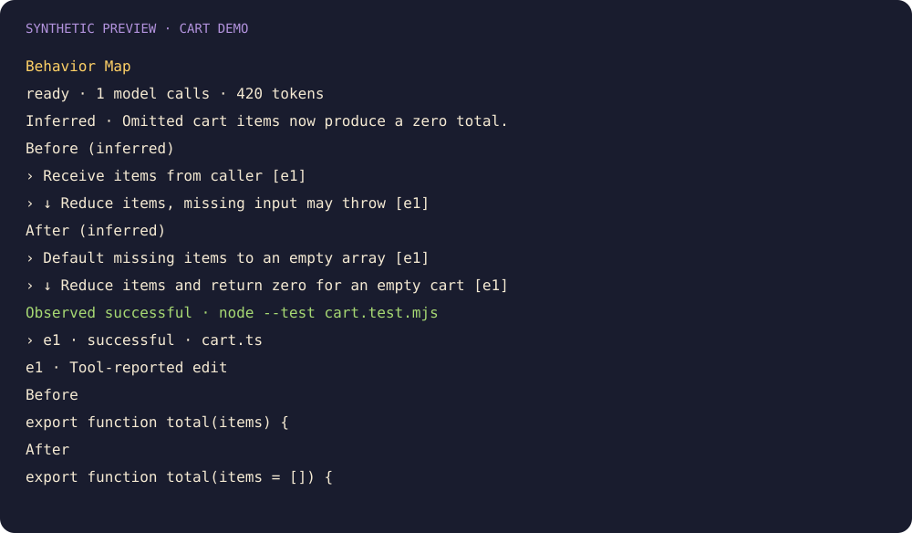

# Behavior Map

Compare paired before-and-after behavior flows. Every inferred step links to collected evidence. Select a node to reveal supporting edits or checks. Narrow panes stack the flows vertically.

```sh
claude plugin marketplace add theonly1me/claude-code-mods
claude plugin install behavior-map@claude-code-mods
```

Register the marketplace once. Run `/reload-plugins` in an open session after installing. Requires Claude Code 2.1.287 or later; no build step or runtime dependencies.

The compact update strip appears automatically. `/behavior` or `/behavior show` opens a detailed pane without stealing focus. `/behavior hide` hides its pane and strip. The map shares Change Journal analysis when available and analyzes independently otherwise.

Default analysis uses `claude-sonnet-5-5` with `medium` effort. Requests debounce for two seconds, remain at least ten seconds apart, and stop after six per main turn. Each has a 4,096-token output limit and a twenty-second timeout. Factual evidence remains available when analysis fails. Code excerpts stay in memory; bounded sanitized evidence goes through your configured Claude provider.



See the [marketplace README](../../README.md) for configuration, privacy, updates, and removal.
