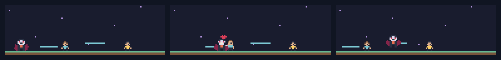

# Bugbound

A custom vampire hunts human villagers in a pixel platformer while Claude works. Reach a human to feed, or let successful checks trigger a meal. Test edits add platforms, and failed checks bring more humans into the scene. Watch it play automatically or take the controls yourself.


```sh
claude plugin marketplace add theonly1me/claude-code-mods
claude plugin install bugbound@claude-code-mods
```

Register the marketplace once. Run `/reload-plugins` in an open session after installing. Requires Claude Code 2.1.287 or later; no build step or runtime dependencies.

Use `/bugbound play` for manual play and `/bugbound watch` for automatic play. Click the game to focus it. Left/Right or A/D move, Space/Up/W jump, and a mouse click moves toward that side and jumps. Buttons also work. Escape returns focus to Claude.

Use `/bugbound show`, `hide`, `compact`, or `expanded`. The most recently selected scene owns the main area. It fills the available prompt-adjacent width, adapts to terminal size, and yields to question dialogs. Desktop uses colored text pixels.



See the [marketplace README](../../README.md) for configuration, privacy, updates, and removal.
