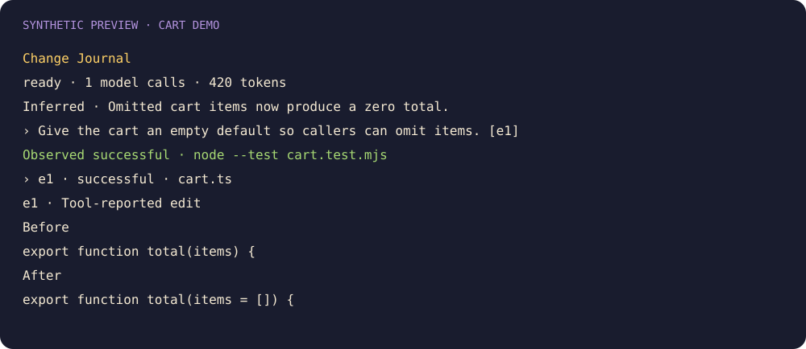

# Change Journal

See successful edits, attempted or denied actions, inferred explanations, and observed test outcomes. Select an entry to reveal supporting before-and-after snippets. Shell comparisons carry an explicit concurrency attribution limit.

```sh
claude plugin marketplace add theonly1me/claude-code-mods
claude plugin install change-journal@claude-code-mods
```

Register the marketplace once. Run `/reload-plugins` in an open session after installing. Requires Claude Code 2.1.287 or later; no build step or runtime dependencies.

The latest-update strip appears automatically. `/changes` or `/changes show` opens a detailed pane without stealing focus. `/changes hide` hides the pane and strip. Live analysis is configured separately with `liveSummaries`, `summaryModel`, and `summaryEffort` in `/plugin`.

Default analysis uses `claude-sonnet-5-5` with `medium` effort. Requests debounce for two seconds, remain at least ten seconds apart, and stop after six per main turn. Each has a 4,096-token output limit and a twenty-second timeout. Factual evidence remains available when analysis fails. Code excerpts stay in memory; bounded sanitized evidence goes through your configured Claude provider.



See the [marketplace README](../../README.md) for configuration, privacy, updates, and removal.
