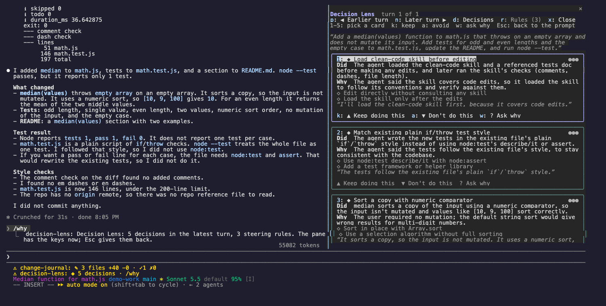

# Decision Lens

See the decisions Claude made in each turn, why it made them, and what it chose not to do. Then steer the next turns: keep a behavior you like, or stop one you do not.



```sh
claude plugin marketplace add theonly1me/claude-code-mods
claude plugin install decision-lens@claude-code-mods
```

Register the marketplace once. Run `/reload-plugins` in an open session after installing. Requires Claude Code 2.1.289 or later; no build step or runtime dependencies.

## How it works

The lens records each turn as Claude works: what Claude wrote, any thinking the model shares, and every tool call with its result. When the turn ends, a helper model reads that trace and names up to five real decisions. The status line then shows `◆ 3 decisions · /why`.

Each decision is a card with:

- what Claude did, and why the trace says it did it,
- the options it did not take,
- a short quote or fact from the trace as evidence,
- how sure the reading is (three dots).

## How to use

1. Work with Claude as usual. After a turn with real work, the status line shows `◆ 3 decisions · /why`.
2. Type `/why`. The lens opens on the latest turn and takes the keys.
3. Read the cards. Press a key from the hint row to steer, or press Esc to go back to the prompt. The pane stays open.

Commands work at any time, also while the pane does not have the keys:

- `/why`: open the lens on the latest turn.
- `/why keep 2`: save a rule from card 2 that tells Claude to repeat the behavior.
- `/why avoid 2`: save a rule from card 2 that tells Claude to stop.
- `/why ask 2`: ask Claude, through the session's own model and cached conversation, to explain card 2 in its own words. The answer appears on the card.
- `/why rules`: open the Rules tab.

Rules go into Claude's system prompt from the next request and in every later session. They are saved for this project. No repository files change.

## How to interact

The hint row under the title always names the keys that work now.

| Key | What it does |
| --- | --- |
| `1` to `5` | Pick a card. The picked card has a bright frame, and its buttons show their keys. |
| `k` | Keep doing this: save the picked card's keep rule. |
| `a` | Don't do this: save the picked card's avoid rule. |
| `w` | Ask why: Claude explains the picked card in its own words. |
| `p`, `n` | Show the earlier or later turn (the last 20 turns). |
| `d`, `r` | Show the Decisions tab or the Rules tab. |
| `x` | Close the lens. |
| Tab, Enter | Move to the next button, and press it. |
| Esc | Give the keys back to the prompt. The pane stays open. |
| ctrl+x tab | Give the keys to the pane again. |

On the Rules tab, each rule is numbered and has two buttons: "Make global" (or "This project only") and "Remove". Use Tab and Enter to press them.

## Settings

Change these in `/plugin`:

- `explainTurns` (on): read each turn with the helper model. This uses extra tokens.
- `helperModel` (`claude-sonnet-5-5`): the model that reads each turn. Ask why always uses the session's model.
- `helperEffort` (`medium`): how hard the helper model thinks (`low`, `medium`, or `high`).

Some models share no thinking text. The lens then works from what Claude wrote and the tool calls it made.

See the [marketplace README](../../README.md) for configuration, privacy, updates, and removal.
