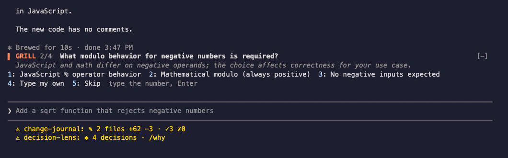

# Grill

While Claude works on your task, a sharp partner asks you the questions that would change the result. Your answers reach Claude in the middle of its turn.



```sh
claude plugin marketplace add theonly1me/claude-code-mods
claude plugin install grill@claude-code-mods
```

Register the marketplace once. Run `/reload-plugins` in an open session after installing. Requires Claude Code 2.1.289 or later; no build step or runtime dependencies.

## How it works

When you send a task (a prompt of eight words or more), Grill reads it with your project's file list and writes three to five questions about requirements, edge cases, and trade-offs. They appear one at a time above the prompt:

```
▌ GRILL 1/4  Should an empty cart be deleted?
  Decides whether empty carts exist in the database.
1: Delete it  2: Keep it  3: Type my own  4: Skip  type the number, Enter
```

To answer, type the number and press Enter. When the prompt is empty and Claude is not streaming text, the number alone works too. "Type my own" opens a small box for a free answer.

If Claude is still working, the answer goes straight into its turn, and Claude adjusts. If the turn already ended, Grill keeps your answers and offers to send them all as one prompt.

While a question is open, a prompt that is only a number answers it instead of going to Claude. Any other prompt goes to Claude as usual.

## Modes

- `/grill grill`: questions on each task (the default).
- `/grill brainstorm`: "what if" ideas on each task. Mark an idea "Worth doing" to send it to Claude.
- `/grill off`: nothing starts by itself.
- `/grill ask` or `/grill ideas`: run a round on your last task now.
- `/grill chat`: a side chat with the helper model about anything. Claude does not see it until you press "Share with Claude", which puts short notes from the chat into your prompt for you to edit and send.

## Settings

Change these in `/plugin`:

- `startMode` (`grill`): the mode for new sessions until you pick one with `/grill`.
- `helperModel` (`haiku`): the model that writes questions and chats with you.

Each round and each chat reply is one helper-model call.

See the [marketplace README](../../README.md) for configuration, privacy, updates, and removal.
