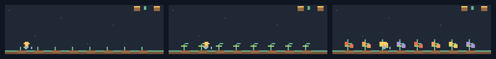

# Little Harvest

Every top-level turn plants a crop bed. Activity waters and grows fruit and vegetables. Normal completion harvests four crops; interruptions and errors keep an unfinished bed. Subagent completion does not harvest the main bed. Baskets and total harvests persist locally.

```sh
claude plugin marketplace add theonly1me/claude-code-mods
claude plugin install little-harvest@claude-code-mods
```

Register the marketplace once. Run `/reload-plugins` in an open session after installing. Requires Claude Code 2.1.287 or later; no build step or runtime dependencies.

The garden plays automatically. Recent unfinished beds and harvest baskets remain visible during the session. Persistent totals restore after a restart.

Use `/farm show`, `hide`, `compact`, or `expanded`. The most recently selected scene owns the main area. It fills the available prompt-adjacent width, adapts to terminal size, and yields to question dialogs. Desktop uses colored text pixels.



See the [marketplace README](../../README.md) for configuration, privacy, updates, and removal.
