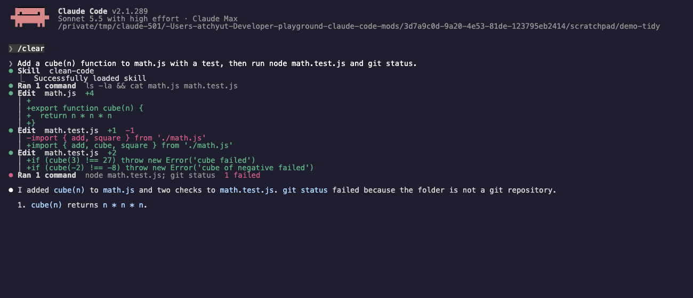
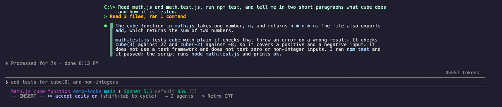
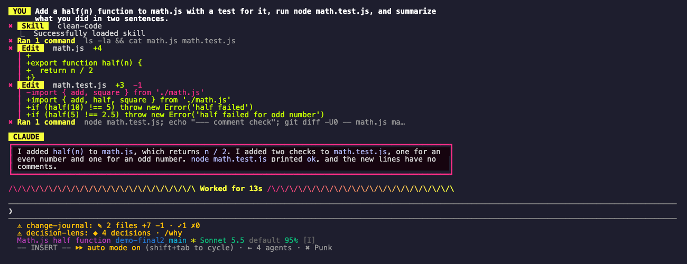
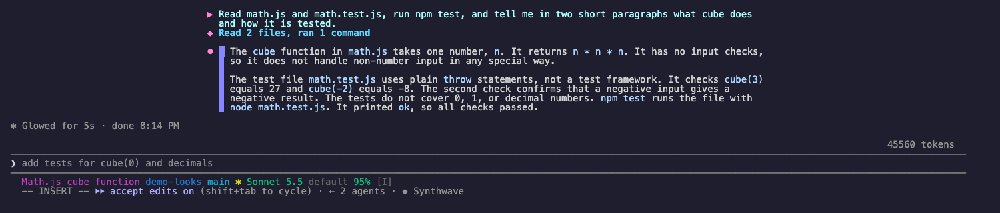
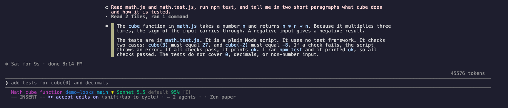

# Looks

Make Claude Code look the way you like: four themes you switch with `/theme`, and two optional layout changes, one line per tool call and replies in a centered reading column.


```sh
claude plugin marketplace add theonly1me/claude-code-mods
claude plugin install looks@claude-code-mods
```

Register the marketplace once. Run `/reload-plugins` in an open session after installing. Requires Claude Code 2.1.289 or later; no build step or runtime dependencies.

## How it works

Looks redraws the rows of the transcript. It never changes what Claude reads or does. Out of the box it tidies tool calls and leaves the layout alone. Themes, compact rows, and the centered layout are choices you make.



- **Tidy tool calls** (setting `toolCalls: full`, the default) draw each call as a header line: a mark, the tool, its target, and a short result such as `+4 -1` or `failed`. Under it, the output sits in a short dim bar. An edit shows only its changed lines in green and red. A shell command shows its first 6 lines and `N more lines (ctrl+o for all)`. Reads, searches, and other calls with no output add nothing under the header. A failed call shows the first lines of its error in red.
- **Compact tool calls** (setting `toolCalls: compact`) draw one line per call and hide the output. A run of reads and searches folds into one line such as `Read 3 files, ran 1 command`. Any other tool, MCP tools included, gets one line with its name and its main argument.
- **Plain tool calls** (setting `toolCalls: plain`) leave every tool row to Claude Code.
- **Centered layout** (setting `layout: centered`) puts replies, prompts, and tool lines in one column at the reading width (100 characters by default), centered in the transcript.
- **Themes** restyle your prompt row, the tool lines, a bar beside each reply, and the end of the hint line under the prompt. They keep Claude Code's own spinner and turn footer words. Turn on `themeWords` if you want the theme's words instead.
- **Base theme**: a theme also sets the Claude Code base theme that suits it, in the same tone (dark or light) as yours. Retro CRT uses the ANSI variant, Zen paper the colorblind-friendly one, and Punk and Synthwave the plain one. If your base theme is `auto`, Looks leaves it alone. `/theme off` and `/exit` put your own base theme back.

## How to use

- `/theme` opens the theme picker.
- `/theme retro`, `/theme punk`, `/theme synthwave`, `/theme zen` switch at once. `/theme off` turns themes off and restores your base theme.
- `/theme base` opens the Claude Code base theme picker. `/looks` does the same as `/theme`.

Your choice is kept for the next sessions. If you change the base theme in `/config` while a Looks theme is on, Looks keeps your new choice as the one to restore.

## How to interact

In the picker:

1. Press `r`, `p`, `s`, or `z` to apply Retro CRT, Punk, Synthwave, or Zen paper, or `o` for Off.
2. Press Tab to move between themes. The preview box shows the theme under the focus before you apply it.
3. Press `b` to open the Claude Code base themes.
4. Press Esc to close the picker.

With tidy or compact tool calls, press ctrl+o to see every tool call in full, with diffs and output. Press ctrl+o again to return.

## Themes

The images below were captured with `themeWords` on, so they show each theme's spinner and footer words. By default your spinner and footer keep Claude Code's own words.

Retro CRT: phosphor green, an amber accent, a `C:\>` prompt, and, with `themeWords` on, `PROCESSING █` while Claude works.



Punk: hot pink and acid yellow, `✖` marks, and, with `themeWords` on, `SHREDDING !!`.



Synthwave: neon magenta and cyan, `▶` and `◆` marks, and, with `themeWords` on, `CRUISING ~`.



Zen paper: quiet ink and moss tones, `○` marks, and, with `themeWords` on, `breathing…`.



## Settings

Change these in `/plugin`:

- `theme` (`off`): the theme for new sessions until you pick one with `/theme`.
- `toolCalls` (`full`): `full` is the tidy view above. `compact` draws one line per call. `plain` keeps Claude Code's own tool rows.
- `layout` (`left`): `centered` puts rows and replies in one column at the reading width. `left` keeps them at the left edge.
- `readingWidth` (`100`): the column width in characters.
- `themeWords` (off): on uses the theme's spinner and footer words, such as `CRUISING` or `Shredded`. Off keeps Claude Code's own words.

## Limits

- The text inside Claude's replies keeps Claude Code's own colors. A theme frames a reply but does not recolor it.
- With `verbose` on in `/config`, Claude Code reports every row as expanded, so ctrl+o cannot switch back to full rows. The tidy view then shows up to 30 lines of output per call. Set `toolCalls` to `plain` to see Claude Code's own rows.
- The tidy view draws its own result lines for edits and shell commands, so it does not show Claude Code's syntax-highlighted diff. ctrl+o does.
- If you quit with ctrl+c twice, the base theme stays on the theme's match until your next session with Looks, or until you run `/theme off`. `/exit` restores it.
- Looks draws only in the terminal. The desktop app and the IDE extensions keep their own look.

See the [marketplace README](../../README.md) for configuration, privacy, updates, and removal.
