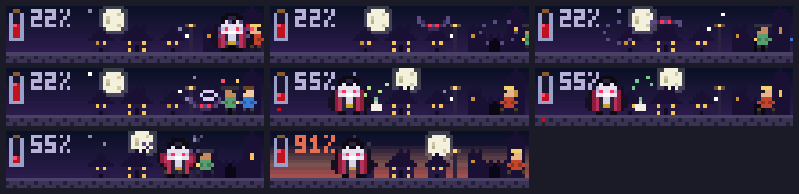

# Night Feast

A vampire hunts a small village above your prompt, and the night sky is your context window.

- The moon moves across the sky as the context fills. At 80% the horizon starts to warm, and at 90% dawn is near. A toast tells you to run `/compact` before the sun comes up.
- Each tool call Claude finishes is a meal: the vampire turns into a bat, swoops down on a villager, and fills its blood vial. The villager wanders off dizzy.
- A failed or denied tool call is garlic. The vampire recoils and loses blood.
- Each prompt you send brings a new villager into the street.
- When Claude finishes a turn, the vampire spreads its cape in front of the castle while bats circle.
- A compaction ends the night. The sky resets to dusk and a new night begins.

The game plays by itself. There is nothing to control.



```sh
claude plugin marketplace add theonly1me/claude-code-mods
claude plugin install night-feast@claude-code-mods
```

Register the marketplace once. Run `/reload-plugins` in an open session after installing. Requires Claude Code 2.1.289 or later; no build step or runtime dependencies.

`/feast` shows or hides the scene and reports the night, the context fill, the blood level, and your feeds. If you hide it, it stays hidden in new sessions until you show it again. It is 8 rows tall, needs at least 44 columns, and steps aside for question dialogs. The desktop app shows a one-line summary.

See the [marketplace README](../../README.md) for configuration, privacy, updates, and removal.
