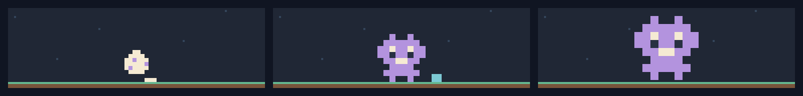

# Pocket Familiar

An original creature begins as an egg, hatches after one completed turn, becomes juvenile after ten, and becomes adult after fifty. It reads, builds, exercises, naps, and celebrates as Claude works. Its growth persists locally.

```sh
claude plugin marketplace add theonly1me/claude-code-mods
claude plugin install pocket-familiar@claude-code-mods
```

Register the marketplace once. Run `/reload-plugins` in an open session after installing. Requires Claude Code 2.1.287 or later; no build step or runtime dependencies.

A compact companion stays visible alongside other selected scenes. `/pet show` selects its full scene. `/pet hide` hides both the scene and the companion strip.

Use `/pet show`, `hide`, `compact`, or `expanded`. The most recently selected scene owns the main area. It fills the available prompt-adjacent width, adapts to terminal size, and yields to question dialogs. Desktop uses colored text pixels.



See the [marketplace README](../../README.md) for configuration, privacy, updates, and removal.
