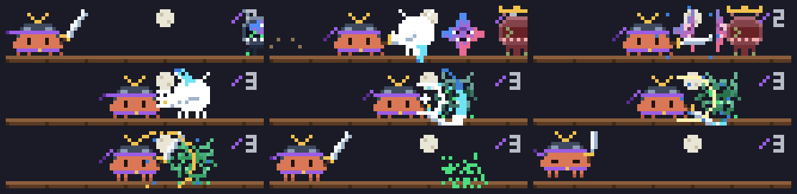

# Samurai Dojo

A Claude samurai guards your prompt. Every tool call Claude makes sends a Codex or Gemini alien into the dojo, and the samurai cuts it down when the call finishes.



```sh
claude plugin marketplace add theonly1me/claude-code-mods
claude plugin install samurai-dojo@claude-code-mods
```

Register the marketplace once. Run `/reload-plugins` in an open session after installing. Requires Claude Code 2.1.289 or later; no build step or runtime dependencies.

## How it fights

- Each tool call spawns an alien. Codex and Gemini take turns.
- When the call finishes, the samurai dashes in and slashes it. Codex aliens scatter into green code, Gemini aliens split apart.
- A subagent call spawns a crowned elite that takes two strikes.
- A failed or denied call costs a parried strike first: a clang, a flinch, then the kill.
- Three kills in quick succession draw a gold flurry crescent.
- When Claude finishes a turn, the samurai cheers.

## Ranks

Lifetime kills earn ranks, shown by the color of the samurai's headband and sash: Ronin (red), Hatamoto at 100 (blue), Daimyo at 500 (violet), and Shogun at 2,000 (gold).

## Command

`/dojo` shows or hides the dojo and prints this session's kills, lifetime kills, your rank, and how far the next rank is. If you hide it, it stays hidden in new sessions until you show it again. The scene is 8 rows tall, stacks with other game mods, and steps aside for question dialogs. The desktop app shows a one-line summary.

See the [marketplace README](../../README.md) for configuration, privacy, updates, and removal.
