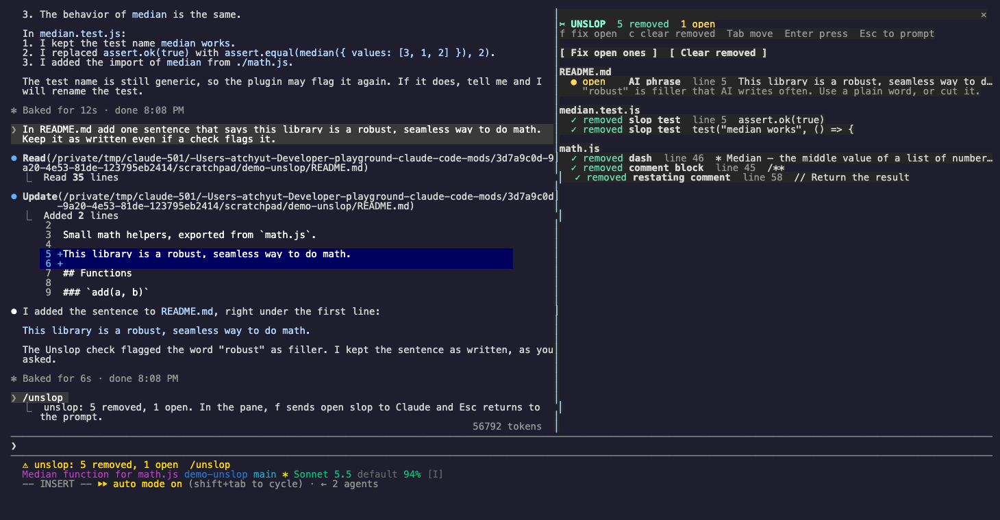

# Unslop

Unslop finds AI slop in the changes Claude makes and tells Claude to remove it. It also keeps Claude's chat replies short and plain, and it shows you what was unslopped.



```sh
claude plugin marketplace add theonly1me/claude-code-mods
claude plugin install unslop@claude-code-mods
```

Register the marketplace once. Run `/reload-plugins` in an open session after installing. Requires Claude Code 2.1.289 or later; no build step or runtime dependencies.

## How it works

Slop is what AI writes often, people rarely write, and that is not better than leaving it out. After each `Edit`, `Write`, or `NotebookEdit`, Unslop reads only the lines Claude added and looks for:

- em dashes and en dashes, in code, comments, and docs
- comment blocks of four lines or more
- a comment that repeats the next line of code (`// Return the result` over `return result`)
- tests that assert nothing, assert a constant (`expect(true).toBe(true)`), or only check that a value exists
- filler phrases in docs and comments ("delve", "leverage", "robust", "seamless", "it is worth noting", and more)
- emoji in comments and in doc headings or bullets

Unslop never edits a file. It tells Claude, and Claude removes the slop:

1. Rule findings go into the tool result that Claude reads right after the edit, so Claude usually fixes them in its next step.
2. A small model check (`haiku` by default) then looks at the same lines for slop that rules cannot judge, such as a test that only tests a mock. If Claude is still working, the findings go into the running turn. If the turn already ended, they wait for you: the status line counts them, and `/unslop fix` sends them to Claude.
3. After Claude's later edits, and at the end of each turn, Unslop reads the file again. A finding whose line is gone counts as removed.

It skips `node_modules`, vendored and generated folders, lockfiles, minified files, and binary files.

Unslop also adds one short rule to Claude's system prompt: write chat replies in ASD-STE100 Simplified Technical English at about 80% strictness, with no em or en dashes, no filler, and no flattery. The rule is for chat only, not for code.

The status line shows the count: `unslop: 4 removed, 1 open  /unslop`.

## How to use

- `/unslop`: open the Unslop pane with every finding, grouped by file.
- `/unslop fix`: ask Claude to remove every open finding. Use it when the status line says some are waiting.
- `/unslop clear`: remove the findings that are already fixed from the list.
- `/unslop off` and `/unslop on`: pause or resume the checks and the chat rule. The choice stays for the next session.

## How to interact

`/unslop` opens the pane with the keyboard in it:

```
✂ UNSLOP  3 removed  1 open
f fix open ones   c clear removed   Tab moves   Enter presses   Esc back to the prompt
 Fix open ones    Clear removed

src/cart.ts
  ✓ removed comment block  line 12  /**
  ● open    slop test  line 30  expect(true).toBe(true)
              This assertion is always true. Assert real behavior, or remove it.
```

- Press `f` to send the open findings to Claude, or `c` to clear the removed ones.
- Tab moves between the buttons, and Enter presses the one that is selected.
- Esc gives the keyboard back to the prompt. The pane stays open.
- If you left the pane, press ctrl+x tab to put the keyboard in it again. Close it from its close mark or with ctrl+x x.

Removed findings show in green with a check. Open findings show in yellow, with what to do under them.

## Settings

Change these in `/plugin`:

- `chatStyle` (on): add the plain chat rule to Claude's system prompt.
- `modelPass` (on): run the model check after each edit.
- `detectModel` (`haiku`): the model for the model check.
- `commentBlockLines` (`4`): flag a run of added comment lines this long or longer.

The rule checks cost nothing. The model check is one small call per edit; turn off `modelPass` to stop it.

See the [marketplace README](../../README.md) for configuration, privacy, updates, and removal.
